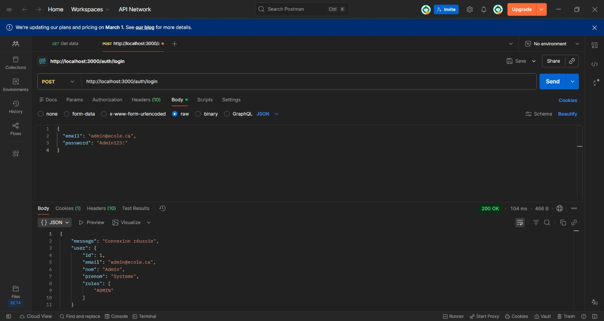
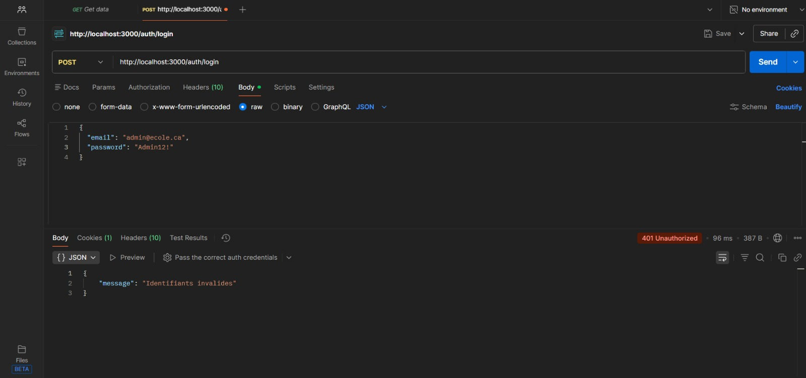
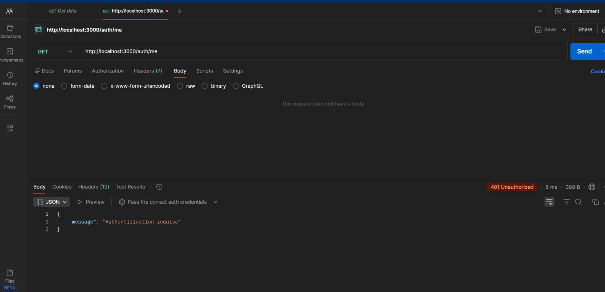
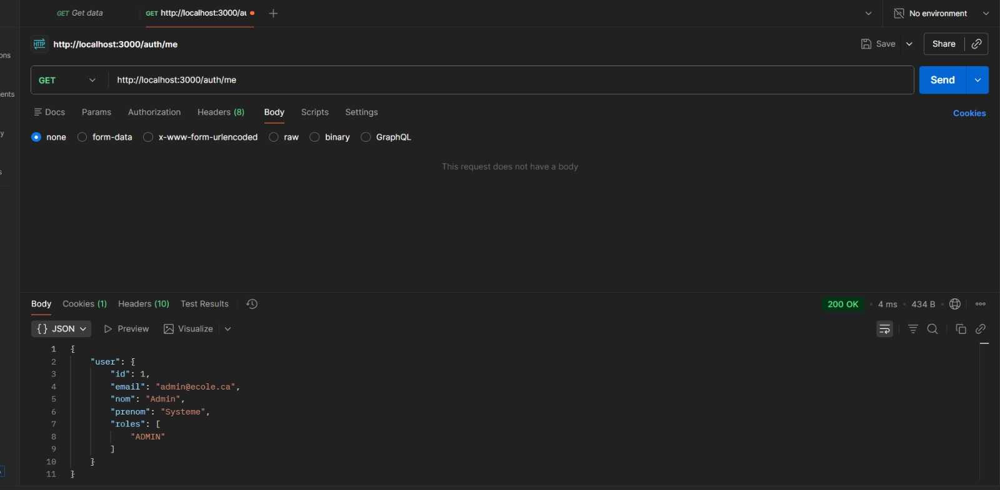

# Authentification

Ce document décrit l'implémentation du système d'authentification
réalisé lors du Sprint 1 du projet **Gestion des horaires**.

Les fonctionnalités mises en place correspondent aux tickets suivants :
- GDH5-47
- GDH5-48
- GDH5-49
- GDH5-50
- GDH5-51
- GDH5-66


---

## GDH5-47 – Création de la table utilisateurs

Une table `utilisateurs` a été créée dans la base de données MySQL afin
de stocker les informations des comptes utilisateurs.

### Champs principaux
- id (clé primaire)
- email (unique)
- mot_de_passe_hash
- nom
- prenom
- actif
- created_at / updated_at

Les mots de passe ne sont **jamais stockés en clair**.

---

## GDH5-48 – Ajout d'un utilisateur administrateur

Un script d'initialisation (`admin.js`) a été créé pour :
- insérer un utilisateur ADMIN par défaut
- hacher le mot de passe avec bcrypt
- associer le rôle ADMIN via la table `utilisateur_roles`

Ce script est exécuté manuellement pour initialiser la base de données.

---

## GDH5-49 – Création de la route login

### Route
- **POST** `/auth/login`

### Données attendues
```json
{
  "email": "admin@ecole.ca",
  "password": "Admin123!"
}
```

## Fonctionnement de la route de connexion

La route **POST /auth/login** suit les étapes suivantes :

- normalisation de l'email (conversion en minuscules et suppression des espaces)
- recherche de l'utilisateur dans la table `utilisateurs`
- vérification que le compte est actif
- récupération des rôles associés à l'utilisateur
- création d'une session utilisateur

### Informations stockées en session

Les données suivantes sont stockées dans `req.session.user` :

- id
- email
- nom
- prénom
- rôles

---

## GDH5-50 – Vérification du mot de passe

La vérification du mot de passe est réalisée à l'aide de **bcrypt** :

- le mot de passe fourni est comparé au hash stocké en base de données
- en cas d'échec, la connexion est refusée
- aucun mot de passe en clair n'est exposé ou retourné au client

---

## GDH5-66 – Définition du mécanisme d'authentification

Le mécanisme d'authentification repose sur les éléments suivants :

- Express
- express-session
- stockage de l'utilisateur authentifié dans `req.session.user`

Un middleware `authRequired` a été implémenté afin de :

- vérifier l'existence d'une session utilisateur active
- protéger les routes sensibles nécessitant une authentification

### Exemple d'utilisation

```js
app.get("/protected", authRequired, (req, res) => {
  res.json({ message: "Accès autorisé" });
});
```

---

## GDH5-51 – Test du login avec Postman

### test de connexion avec des identifiants valides


### test avec un mot de passe incorrect


### test d'accès sans authentification


### test de récupération de la session via la route **/auth/me**


---

## Conclusion

Ce document décrit :
1. la structure de la table `utilisateurs`
2. le fonctionnement de la route de connexion
3. la gestion des sessions utilisateur
4. le lien avec la gestion des rôles (ADMIN, RESPONSABLE)

La gestion détaillée des rôles est documentée dans un fichier séparé :
`docs/gestion-des-roles.md`
