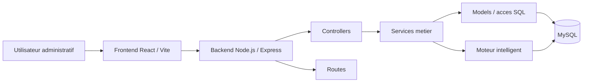

# Conception complete du systeme Horaires-5

## 1. Objet du document

Ce document formalise la conception globale du projet **Horaires-5** a partir de l'implementation actuelle du depot.

L'objectif est de fournir une base de livraison professionnelle, exploitable telle quelle dans un rendu `.md` ou `.docx`, couvrant :

- l'architecture globale du systeme ;
- la decomposition backend, frontend et base de donnees ;
- la conception complete du moteur intelligent ;
- les regles metier et les contraintes ;
- les exceptions et mecanismes de reprise ;
- les diagrammes UML requis ;
- la structure finale du projet.

Le document est aligne avec le code present dans :

- `Backend/src/app.js`
- `Backend/routes/*.routes.js`
- `Backend/src/model/*.js`
- `Backend/src/services/**/*`
- `Backend/src/controllers/**/*`
- `Frontend/src/**/*`
- `Backend/Database/GDH5.sql`

## 2. Description generale du systeme

Horaires-5 est une application web de gestion des horaires pour une institution academique. Le systeme couvre la gestion des ressources pedagogiques, la planification automatique, la correction manuelle, la gestion des reprises, les horaires cibles par professeur/groupe/etudiant, la simulation de scenarios et l'export documentaire.

Le coeur fonctionnel du projet repose sur une idee simple : **produire un horaire academique stable, coherent et explicable**, tout en laissant la possibilite de corriger localement l'horaire sans regenerer l'ensemble du calendrier.

### 2.1 Acteurs authentifies du systeme

Le systeme doit supporter **deux types d'utilisateurs authentifies uniquement** :

| Type d'utilisateur | Role metier | Responsabilites principales |
|---|---|---|
| `Responsable administratif` | autorite fonctionnelle superieure | gestion globale, creation et administration des comptes administrateurs, gestion des cours, salles et professeurs, affectation des cours aux salles, plages horaires et professeurs, pilotage du moteur intelligent |
| `Administrateur` | operateur de la plateforme | gestion des profils utilisateurs dans son perimetre, gestion des autres modules autorises, consultation des horaires, gestion des groupes et etudiants, export et traitement des operations operationnelles |

Regle de conception fondamentale :

- **Professeur** et **Etudiant** ne sont pas des acteurs connectes dans Horaires-5.
- Ils sont des **entites metier gerees par le systeme**, mais ils ne disposent pas d'un acces applicatif direct.
- Toute consultation, planification, export ou correction relative a un professeur ou a un etudiant est realisee par un utilisateur administratif authentifie.

Point d'alignement avec l'implementation actuelle :

- le code comporte encore des traces du role technique `ADMIN_RESPONSABLE` ;
- dans la conception cible, ce role doit etre interprete comme un **alias technique transitoire** du `Responsable administratif`, et non comme un troisieme type d'utilisateur.

## 3. Architecture globale

### 3.1 Vue d'ensemble

L'application suit une architecture web en trois couches principales :

- **Frontend** : application React/Vite pour l'interface utilisateur.
- **Backend** : application Node.js/Express pour l'API REST, l'authentification, la logique metier et le moteur de planification.
- **Base de donnees** : MySQL pour la persistance des referentiels, des affectations, des rapports et des journaux metier.

Le moteur intelligent n'est pas un service externe. Il est integre au backend dans un sous-ensemble specialise de services.

### 3.2 Architecture logique



### 3.3 Separation des responsabilites

#### Controllers

Les controllers ont un role d'adaptation HTTP. Ils :

- normalisent le payload ;
- recuperent l'utilisateur courant ;
- deleguent la logique metier aux services ;
- traduisent les erreurs metier en reponses JSON.

Exemple actuel :

- `Backend/src/controllers/scheduler/ScheduleModificationController.js`

#### Services

Les services portent la logique metier. Ils :

- appliquent les regles fonctionnelles ;
- orchestrent les traitements transactionnels ;
- composent plusieurs models ;
- encapsulent le moteur intelligent et les flux avances.

Exemples actuels :

- `Backend/src/services/planning/manual-planning.service.js`
- `Backend/src/services/etudiants/student-course-exchange.service.js`
- `Backend/src/services/ExportService.js`
- `Backend/src/services/scheduler/**/*`

#### Models

Les models gerent l'acces aux donnees et aux requetes SQL. Ils :

- lisent et ecrivent dans MySQL ;
- centralisent les requetes de domaine ;
- restent decouples des contrats HTTP.

Exemples actuels :

- `Backend/src/model/cours.model.js`
- `Backend/src/model/professeurs.model.js`
- `Backend/src/model/salle.js`
- `Backend/src/model/groupes.model.js`
- `Backend/src/model/etudiants.model.js`
- `Backend/src/model/horaire.js`

#### Moteur intelligent

Le moteur intelligent constitue un sous-systeme specialise. Il :

- charge le contexte de la session ;
- forme les groupes ;
- construit les contraintes ;
- genere une semaine type recurrente ;
- gere les reprises ;
- calcule un score de qualite ;
- persiste les affectations et les rapports ;
- supporte les simulations what-if et la replanification locale.

Exemples actuels :

- `Backend/src/services/scheduler/SchedulerEngine.js`
- `Backend/src/services/scheduler/ContextLoader.js`
- `Backend/src/services/scheduler/GroupFormer.js`
- `Backend/src/services/scheduler/ConstraintMatrix.js`
- `Backend/src/services/scheduler/FailedCourseEngine.js`
- `Backend/src/services/scheduler/optimization/*`
- `Backend/src/services/scheduler/scoring/*`
- `Backend/src/services/scheduler/simulation/*`

## 4. Modules fonctionnels

| Module | Responsabilite principale | Entrees | Sorties |
|---|---|---|---|
| Authentification | gerer la session, les roles et l'acces | email, mot de passe, session | utilisateur authentifie |
| Gestion des cours | CRUD du catalogue pedagogique | cours, programme, etape, salle de reference | cours valides |
| Gestion des professeurs | CRUD, habilitations et disponibilites temporelles | professeur, cours, disponibilites | professeurs planifiables |
| Gestion des salles | CRUD, occupation et capacite | salle, type, capacite | salles exploitables |
| Gestion des etudiants | import, consultation, horaire effectif | cohortes, reprises, exceptions | horaire etudiant, charge |
| Gestion des groupes | lecture, creation, affectation d'etudiants | groupes, session, etudiants | groupes reels et speciaux |
| Planification standard | CRUD d'affectations et corrections locales | cours, groupe, professeur, salle, plage | affectations valides |
| Moteur intelligent | generation globale de session | session, ressources, contraintes | horaire complet, rapport |
| Simulation what-if | evaluation read-only de scenarios | scenario, snapshot officiel | comparaison avant/apres |
| Echanges etudiants | permutation locale de section | deux etudiants, cours cible | overrides individuels traces |
| Export | export PDF / Excel des horaires | cible, id, format | document exporte |

## 5. Architecture detaillee par couche

### 5.1 Backend Node.js / Express

Le backend expose une API REST segmentee par domaine :

- `auth.routes.js`
- `cours.routes.js`
- `professeurs.routes.js`
- `salles.routes.js`
- `etudiants.routes.js`
- `groupes.routes.js`
- `horaire.routes.js`
- `scheduler.routes.js`
- `export.routes.js`
- `dashboard.routes.js`

Responsabilites principales du backend :

- securiser l'acces via session et roles ;
- exposer les flux CRUD et les flux metier ;
- declencher les traitements transactionnels ;
- executer le moteur intelligent ;
- centraliser les validations metier ;
- produire les rapports et les exports.

### 5.2 Frontend React

Le frontend est organise autour de trois familles de composants :

- **Pages** : ecrans complets, orientes parcours utilisateur ;
- **Components** : widgets et panneaux specialises ;
- **Services API** : client HTTP vers le backend.

Pages principales actuelles :

- `SchedulerPage.jsx`
- `AffectationsPage.jsx`
- `HorairesProfesseursPage.jsx`
- `HorairesGroupesPage.jsx`
- `HorairesSallesPage.jsx`
- `EtudiantsPage.jsx`
- `DisponibilitesProfesseursPage.jsx`
- `CoursPage.jsx`
- `ProfesseursPage.jsx`
- `SallesPage.jsx`
- `GestionGroupesPage.jsx`

Le frontend ne contient pas la logique de planification. Il :

- collecte les intentions utilisateur ;
- appelle l'API ;
- affiche les horaires et les diagnostics ;
- guide la correction manuelle ;
- affiche les simulations et les rapports.

Les pages de consultation des horaires professeurs et etudiants ne constituent donc pas des portails de connexion dedies. Elles sont utilisees par les acteurs administratifs pour consulter ou traiter les donnees metier.

### 5.3 Base de donnees MySQL

Les entites principales sont :

- `utilisateurs`
- `cours`
- `professeurs`
- `professeur_cours`
- `salles`
- `sessions`
- `groupes_etudiants`
- `etudiants`
- `disponibilites_professeurs`
- `absences_professeurs`
- `salles_indisponibles`
- `plages_horaires`
- `affectation_cours`
- `affectation_groupes`
- `affectation_etudiants`
- `cours_echoues`
- `prerequis_cours`
- `echanges_cours_etudiants`
- `planification_series`
- `rapports_generation`

Le pivot de planification est `affectation_cours`, lie a :

- un cours ;
- un professeur ;
- une salle ;
- une plage horaire.

La liaison avec un groupe se fait via `affectation_groupes`. Les exceptions individuelles et les reprises se font via `affectation_etudiants`.

## 6. Regles metier et contraintes

### 6.1 Contraintes dures

Les contraintes dures sont non negociables. Une affectation qui les viole est refusee.

- Un professeur ne peut pas enseigner deux seances qui se chevauchent.
- Une salle ne peut pas etre occupee par deux seances au meme moment.
- Un groupe ne peut pas suivre deux seances simultanement.
- Un etudiant ne peut pas avoir deux cours au meme moment, y compris en cas de reprise ou d'exception individuelle.
- Un cours presentiel doit etre affecte a une salle compatible avec son `type_salle`.
- La capacite de la salle doit couvrir l'effectif reel ou projete du groupe.
- Un professeur doit etre compatible pedagogiquement avec le cours.
- Une affectation doit respecter les disponibilites et absences du professeur.
- Une affectation doit respecter les indisponibilites de salle.
- Une session doit exister avant toute generation.
- Une occurrence doit rester dans la fenetre de la session.
- Un prerequis bloquant doit etre respecte pour les enchainements de cours.
- Apres deux cours consecutifs, une pause minimale de 60 minutes est obligatoire avant un troisieme cours consecutif pour la meme ressource pedagogique.

### 6.2 Contraintes structurelles

- Le moteur vise `7` seances hebdomadaires par groupe.
- Un groupe ne doit pas depasser `3` seances par jour.
- Un professeur ne doit pas depasser `4` seances par jour.
- Un professeur ne doit pas depasser `12` seances hebdomadaires.
- Le nombre de groupes distincts et de cours distincts par professeur est borne.
- Le moteur recherche une **semaine type stable** sur toute la session.

### 6.3 Contraintes souples

Les contraintes souples servent a scorer et optimiser l'horaire sans invalider sa faisabilite.

- limiter les trous dans les journees ;
- equilibrer les charges entre professeurs ;
- repartir la charge des groupes sur plusieurs jours actifs ;
- preferer des horaires pedagogiquement confortables ;
- conserver une stabilite vis-a-vis des affectations historiques ;
- minimiser les cours non planifies ;
- minimiser les degradations lors des replanifications locales.

### 6.4 Regles sur les cours echoues

- Une reprise ne detruit pas l'affectation de groupe d'origine.
- Le moteur tente d'abord de rattacher l'etudiant a une section reelle deja planifiee.
- Si aucun rattachement n'est possible, la reprise reste en conflit explicable.
- Les reprises retenues sont persistees via `affectation_etudiants`.
- Les reprises non resolues alimentent `resolutions_manuelles` et le rapport de generation.

### 6.5 Regles sur les echanges de cours entre etudiants

- L'echange est une exception individuelle tracee, pas une modification structurelle du groupe.
- L'echange est refuse si la section cible cree un conflit horaire.
- La previsualisation et l'execution refont la validation pour eviter une incoherence entre temps de simulation et temps de persistance.
- L'etat avant/apres est journalise dans `echanges_cours_etudiants`.

## 7. Gestion des exceptions

Le systeme gere les exceptions a trois niveaux.

### 7.1 Exceptions de disponibilite

Quand les disponibilites d'un professeur changent :

- le systeme ne regenere pas tout l'horaire ;
- il declenche une replanification locale des seances impactees ;
- il journalise le resultat de la correction.

### 7.2 Exceptions individuelles

Un etudiant peut suivre un horaire effectif different de son groupe de base via :

- une reprise ;
- un echange de section ;
- une affectation individuelle.

L'horaire etudiant est donc une composition de :

- l'horaire du groupe principal ;
- les rattachements individuels ;
- les exceptions visibles.

### 7.3 Exceptions de planification

Une operation peut etre refusee avec message metier si :

- la ressource cible n'existe pas ;
- le creneau est invalide ;
- la session est absente ;
- une contrainte de conflit est detectee ;
- une simulation obligatoire bloque la modification ;
- la degradation de score est trop forte.

## 8. Conception complete du moteur intelligent

### 8.1 Objectif du moteur

Le moteur intelligent a pour mission de produire un horaire academique faisable, stable et explicable pour une session complete, en integrant :

- les cours du catalogue ;
- les ressources pedagogiques ;
- les disponibilites et indisponibilites ;
- la charge des groupes ;
- les reprises etudiants ;
- le scoring de qualite ;
- la persistance finale et le rapport metier.

### 8.2 Principes de conception

Le moteur repose sur six principes.

- **Session first** : toute generation est attachee a une session academique.
- **Motif recurrent** : on planifie une semaine type stable repliquee sur la session.
- **Hard constraints first** : les contraintes dures sont validees avant toute persistance.
- **Explainability** : tout echec alimente un diagnostic ou un rapport.
- **Local correction** : les ajustements fins se font par optimisation locale et replanification ciblee, sans relancer une generation totale.
- **Transactional persistence** : la persistance finale est atomique.

### 8.3 Structures de donnees centrales

#### Rapport de generation

Le moteur construit un objet `rapport` contenant :

- session ;
- score de qualite ;
- score initial ;
- affectations generees ;
- cours non planifies ;
- reprises traitees ;
- resolutions manuelles ;
- details du scoring et du rapport metier.

#### Contexte charge

Le `ContextLoader` produit un contexte contenant :

- session cible ;
- cours actifs ;
- professeurs et habilitations ;
- salles ;
- etudiants filtres sur la session ;
- groupes existants ;
- disponibilites, absences et indisponibilites ;
- affectations existantes ;
- cours echoues ;
- prerequis.

#### Matrice de contraintes

La `ConstraintMatrix` maintient en memoire :

- l'occupation des salles ;
- l'occupation des professeurs ;
- l'occupation des groupes ;
- l'occupation des etudiants ;
- les charges hebdomadaires ;
- le nombre de cours et groupes distincts par professeur.

#### Index de candidats horaires

Le `CandidatePrecomputer` et les generateurs de creneaux produisent :

- les heures de debut valides pour un cours selon sa duree ;
- les metadata de slots ;
- un cache par duree ;
- une base pour classer les cours les plus contraints.

### 8.4 Etapes d'execution du moteur

#### Etape 0 - Preparation technique

Avant toute generation, le backend appelle :

- `assurerSchemaSchedulerAcademique()`
- `SchedulerDataBootstrap.ensureOperationalDataset()`

Cette etape garantit :

- le schema minimal attendu ;
- l'existence des tables de reprise et d'exception ;
- un dataset academique exploitable si la base est partiellement vide.

#### Etape 1 - Chargement des donnees

Le `ContextLoader` charge la session cible puis agregue :

- les cours non archives ;
- les professeurs et leurs `cours_ids` ;
- les salles ;
- les etudiants de la session ;
- les groupes de session ;
- les disponibilites par professeur ;
- les absences par professeur ;
- les indisponibilites de salles ;
- les affectations existantes ;
- les cours echoues planifiables ;
- les prerequis.

Sortie de l'etape :

- un contexte complet, coherent et filtre sur la session.

#### Etape 2 - Analyse des contraintes

L'analyse des contraintes combine :

- `ConstraintMatrix` pour les conflits spatio-temporels ;
- `AvailabilityChecker` pour les disponibilites ;
- `BreakConstraintValidator` pour les pauses obligatoires ;
- `AcademicCatalog` et `SchedulerConfig` pour les plafonds et constantes ;
- les prerequis, capacites et compatibilites.

Objectif :

- transformer les regles metier en verifications rapides avant placement.

#### Etape 3 - Generation des creneaux possibles

Le moteur construit :

- la liste des jours de la session ;
- l'index `datesParJourSemaine` ;
- la grille horaire academique ;
- la `courseTimeCandidateMap` pour chaque cours.

Les candidats sont calcules selon :

- la duree du cours ;
- la plage journaliere autorisee ;
- la granularite des slots ;
- la politique presentiel / en ligne.

#### Etape 4 - Attribution cours -> groupe

Le moteur :

- forme les groupes reels via `GroupFormer` ;
- trie les cours du plus contraint au moins contraint via `CoursePrioritySorter` ;
- filtre les professeurs compatibles ;
- filtre les salles compatibles ;
- cherche un motif recurrent `jour + creneau + professeur + salle` pour chaque couple `cours / groupe / seance`.

La recherche principale est realisee par `_trouverSerieHebdomadaire()` avec :

- priorite aux professeurs les moins charges ;
- priorite aux salles juste suffisantes ;
- prise en compte de la stabilite historique ;
- objectif de couverture sur les dates d'un meme jour ;
- respect des plafonds journaliers et hebdomadaires.

#### Etape 5 - Verification des conflits

Pour chaque candidat retenu, le moteur verifie :

- professeur libre ;
- salle libre ;
- groupe libre ;
- etudiants libres ;
- disponibilite du professeur ;
- disponibilite de la salle ;
- respect des pauses obligatoires ;
- respect des charges maximales.

Si la recherche stricte echoue :

- le moteur lance une **passe assouplie** via `_trouverSerieAssouplie()` ;
- il peut accepter une couverture plus faible ;
- il peut basculer vers un mode hybride ou en ligne si la configuration l'autorise.

Ensuite, une **passe de garantie** tente de rapprocher chaque groupe de la cible de 7 seances par semaine.

#### Etape 6 - Optimisation a score equilibre

Le moteur evalue la solution puis lance une optimisation locale en lecture seule.

L'optimisation actuelle combine :

- `PlacementEvaluator`
- `LocalSearchOptimizer`
- `ScheduleScorer`

Les modes d'optimisation supportes sont :

- `legacy`
- `etudiant`
- `professeur`
- `equilibre`

Le mode de reference pour une livraison academique est **equilibre**, car il arbitre entre :

- confort des etudiants ;
- confort des professeurs ;
- qualite structurelle des groupes.

Important :

- le code contient encore `SimulatedAnnealing`, mais la generation recurrente stabilisee neutralise le recuit simule en production de resultat ;
- l'optimisation retenue dans le moteur actuel est une **optimisation locale non destructive**, plus coherente avec le motif hebdomadaire stable.

#### Etape 7 - Gestion des cours echoues

Le `FailedCourseEngine` prend les placements deja generes et tente de :

- retrouver des sections reelles compatibles pour chaque reprise ;
- verifier la capacite restante ;
- verifier l'absence de conflit avec l'horaire effectif de l'etudiant ;
- reserver les placements retenus dans la matrice ;
- produire des diagnostics pour les cas impossibles.

Resultats :

- `affectationsReprises`
- `conflitsReprises`
- statistiques sur les reprises.

#### Etape 8 - Generation finale des horaires

La phase finale :

- persiste les `plages_horaires` ;
- persiste les `affectation_cours` ;
- persiste les `affectation_groupes` ;
- persiste les `affectation_etudiants` pour les reprises ;
- marque les cas non resolus ;
- construit le rapport metier ;
- persiste `rapports_generation` ;
- commit la transaction.

Le resultat est :

- un horaire officiel de session ;
- un rapport technique ;
- un rapport metier exploitable par l'administration.

### 8.5 Algorithme professionnel du moteur

Le moteur suit une strategie en quatre temps :

1. **Construire un contexte propre et borne par session**.
2. **Placer d'abord les cours les plus difficiles**.
3. **Valider toutes les contraintes dures avant retention**.
4. **Ameliorer localement puis persister atomiquement**.

Cette approche est plus robuste qu'une generation naive, car elle :

- reduit les impasses tardives ;
- privilegie les ressources rares ;
- garde un planning recurrent ;
- conserve une explication precise en cas d'echec.

### 8.6 Pseudo-code du moteur

```text
fonction GenererHoraireIntelligent(idSession, idUtilisateur, modeOptimisation):
    assurerSchemaSchedulerAcademique()
    assurerDatasetOperationnel()

    ouvrir transaction

    rapport <- initialiserRapport()
    contexte <- ContextLoader.charger(idSession)
    verifierPresenceSessionCoursProfesseursSalles(contexte)

    groupesFormes, affectationsEtudiantGroupe <- GroupFormer.formerGroupes(
        contexte.etudiants,
        contexte.cours,
        contexte.echouesParEtudiant
    )

    idGroupeParNom <- persisterGroupes(groupesFormes)
    mettreAJourGroupesEtudiants(affectationsEtudiantGroupe)

    matrice <- nouvelle ConstraintMatrix()
    jours <- genererJoursSession(contexte.session)
    datesParJourSemaine <- indexerDatesParJourSemaine(jours)
    candidatsParCours <- precalculerCreneaux(contexte.cours)
    preferencesStabilite <- construirePreferencesDepuisAffectationsExistantes()

    supprimerHoraireExistantDeLaSession()

    solution <- []
    nonPlanifies <- []

    coursTries <- trierCoursDuPlusContraintAuMoinsContraint(contexte.cours)

    pour chaque cours dans coursTries:
        groupesCompatibles <- trouverGroupesCompatibles(cours, groupesFormes)
        professeursCompatibles <- trouverProfesseursCompatibles(cours, contexte.professeurs)
        sallesCompatibles <- trouverSallesCompatibles(cours, contexte.salles)

        si professeursCompatibles est vide:
            enregistrerNonPlanifie(cours, "Aucun professeur compatible")
            continuer

        pour chaque groupe dans groupesCompatibles:
            pour numeroSeance de 1 a cours.sessions_par_semaine:
                serie <- trouverSerieHebdomadaire(
                    cours,
                    groupe,
                    professeursCompatibles,
                    sallesCompatibles,
                    datesParJourSemaine,
                    candidatsParCours[cours.id],
                    matrice,
                    disponibilites,
                    absences,
                    indisponibilites,
                    preferencesStabilite,
                    modeOptimisation
                )

                si serie existe:
                    ajouter serie a solution
                    reserver serie dans matrice
                sinon:
                    enregistrerNonPlanifie(cours, groupe, "Aucun motif stable")

    solution, nonPlanifies <- executerPasseAssouplieSiNecessaire(
        solution,
        nonPlanifies,
        contexte,
        groupesFormes,
        matrice,
        modeOptimisation
    )

    solution, nonPlanifies <- executerPasseGarantie7CoursParGroupe(
        solution,
        nonPlanifies,
        contexte,
        groupesFormes,
        matrice
    )

    affectationsReprises, conflitsReprises <- FailedCourseEngine.rattacherCoursEchoues(
        echouesParEtudiant = contexte.echouesParEtudiant,
        placementsPlanifies = solution,
        matrice = matrice
    )

    scoringAvant, solutionOptimisee, scoringApres <- optimiserLocalement(
        solution,
        contexte,
        groupesFormes,
        affectationsEtudiantGroupe,
        affectationsReprises,
        matrice,
        modeOptimisation
    )

    pour chaque placement dans solutionOptimisee:
        persisterPlageHoraire(placement.date, placement.heure_debut, placement.heure_fin)
        idAffectation <- persisterAffectationCours(placement)
        persisterAffectationGroupe(idAffectation, placement.id_groupe)

    persisterReprises(affectationsReprises)
    journaliserConflitsReprises(conflitsReprises)

    rapport <- construireRapportFinal(
        solutionOptimisee,
        nonPlanifies,
        affectationsReprises,
        conflitsReprises,
        scoringAvant,
        scoringApres
    )

    persisterRapport(rapport, idSession, idUtilisateur)
    commit transaction

    retourner rapport
fin fonction
```

## 9. Documentation technique par module

### 9.1 Module Authentification

Responsabilites :

- connexion et deconnexion ;
- restauration de session ;
- controle des acces des deux utilisateurs administratifs du systeme.

Regle de conception :

- seuls `Administrateur` et `Responsable administratif` s'authentifient ;
- `Professeur` et `Etudiant` n'utilisent pas de connexion applicative ;
- si l'implementation expose encore `ADMIN_RESPONSABLE`, il doit etre traite comme un alias technique transitoire du `Responsable administratif`.

Sortie attendue :

- un utilisateur authentifie ;
- un perimetre d'acces aux pages et routes.

### 9.2 Module Cours

Responsabilites :

- creer, lire, modifier, supprimer des cours ;
- maintenir le lien entre cours, programme, etape et salle de reference ;
- garantir la coherence du `type_salle`.

### 9.3 Module Professeurs

Responsabilites :

- gerer les professeurs ;
- maintenir les habilitations `professeur_cours` ;
- gerer les disponibilites temporelles ;
- replanifier localement les seances impactees.

### 9.4 Module Salles

Responsabilites :

- gerer le referentiel des salles ;
- exposer l'occupation detaillee ;
- calculer les indicateurs d'utilisation.

### 9.5 Module Etudiants

Responsabilites :

- importer les cohortes ;
- reconstruire l'horaire effectif ;
- gerer les reprises ;
- gerer les echanges de sections.

### 9.6 Module Groupes

Responsabilites :

- lire et manipuler les groupes reels ;
- rattacher ou deplacer des etudiants ;
- lancer une generation ciblee si necessaire.

### 9.7 Module Horaires

Responsabilites :

- CRUD sur les affectations ;
- planification manuelle ;
- replanification manuelle ;
- validation locale des conflits.

### 9.8 Module Export

Responsabilites :

- produire des PDF et Excel pour professeur, groupe et etudiant ;
- formater les horaires avec conventions visuelles metier ;
- distinguer clairement les reprises.

### 9.9 Module Simulation et replanification intelligente

Responsabilites :

- charger un snapshot officiel de l'horaire ;
- simuler un scenario what-if sans ecriture ;
- comparer avant/apres ;
- imposer une simulation obligatoire avant modification reelle ;
- appliquer la mutation retenue dans une transaction atomique.

## 10. Diagrammes UML

Les sources Mermaid sont conservees dans `documents/diagrammes/*.mmd`. Les rendus `svg` ci-dessous sont fournis pour garantir l'affichage dans les editeurs qui ne prennent pas en charge Mermaid.

### 10.1 Diagramme de cas d'utilisation


Lecture du diagramme :

- le **Responsable administratif** est l'acteur de gouvernance globale et de planification ;
- l'**Administrateur** est l'acteur operationnel delegue ;
- `Professeur` et `Etudiant` n'apparaissent pas comme acteurs UML car ils ne se connectent pas a la plateforme.

### 10.2 Diagramme de classes


### 10.3 Diagramme de sequence - Generation d'un horaire


### 10.4 Diagramme de sequence - Planification manuelle


### 10.5 Diagramme de sequence - Echange de cours entre etudiants


### 10.6 Diagramme d'activite - Processus du moteur intelligent


## 11. Structure finale du projet

### 11.1 Structure logique cible

```text
Backend/
  controllers/
    AuthController.js
    CoursController.js
    ProfesseursController.js
    SallesController.js
    EtudiantsController.js
    GroupesController.js
    HoraireController.js
    scheduler/
      ScheduleModificationController.js
  services/
    auth/
    cours/
    professeurs/
    salles/
    etudiants/
    planning/
    export/
  models/
    UtilisateurModel.js
    CoursModel.js
    ProfesseurModel.js
    SalleModel.js
    GroupeModel.js
    EtudiantModel.js
    HoraireModel.js
  routes/
    auth.routes.js
    cours.routes.js
    professeurs.routes.js
    salles.routes.js
    etudiants.routes.js
    groupes.routes.js
    horaire.routes.js
    scheduler.routes.js
    export.routes.js
  moteur/
    SchedulerEngine.js
    ContextLoader.js
    GroupFormer.js
    ConstraintMatrix.js
    AvailabilityChecker.js
    FailedCourseEngine.js
    SchedulerReportService.js
    planning/
    optimization/
    scoring/
    simulation/
    constraints/
    time/
Frontend/
  pages/
  components/
  services/
  hooks/
  utils/
  styles/
Database/
  schema/
  migrations/
```

### 11.2 Correspondance avec le depot actuel

Le depot actuel suit deja cette logique, avec une organisation physique legerement differente :

- `Backend/routes/` correspond deja a la couche **routes**.
- `Backend/src/controllers/` correspond a la couche **controllers**.
- `Backend/src/model/` correspond a la couche **models**.
- `Backend/src/services/` correspond a la couche **services**.
- `Backend/src/services/scheduler/` correspond a la couche **moteur**.
- `Frontend/src/pages/` et `Frontend/src/components/` correspondent deja a la structure cible du frontend.

## 12. Decisions d'architecture a retenir

- Le moteur intelligent doit rester dans une couche specialisee et ne pas etre disperse dans les routes.
- Les echanges d'etudiants doivent rester modelises comme des overrides individuels, pas comme des mutations de groupes.
- La replanification intelligente doit toujours passer par une simulation prealable.
- Les disponibilites professeurs doivent etre temporelles et historisees.
- Les rapports de generation doivent etre consideres comme des artefacts metier, pas comme de simples logs.
- La semaine type recurrente est la contrainte structurante du systeme actuel.

## 13. Conclusion

Horaires-5 est concu comme un systeme de planification academique hybride :

- un **socle CRUD** pour les ressources et les affectations ;
- un **moteur intelligent** pour la generation globale ;
- une **couche de correction locale** pour la replanification et les exceptions ;
- une **couche de restitution** pour les horaires, la recherche et les exports.

La conception retenue est coherente avec l'implementation existante et suffisamment modulaire pour evoluer vers :

- un ordonnanceur separe si la volumetrie augmente ;
- des profils de scoring plus riches ;
- des simulations plus fines ;
- une meilleure gouvernance des contraintes pedagogiques.
