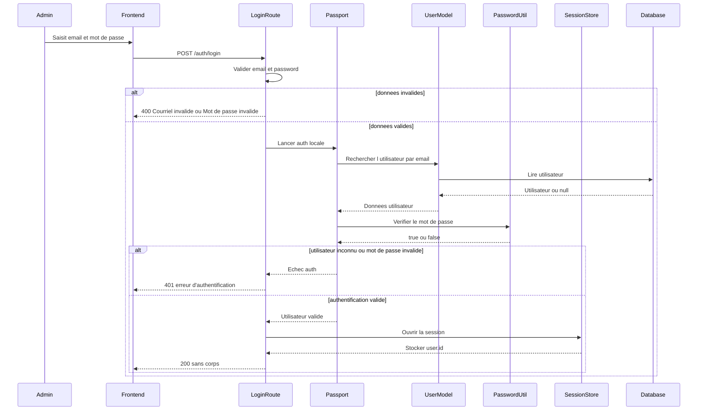
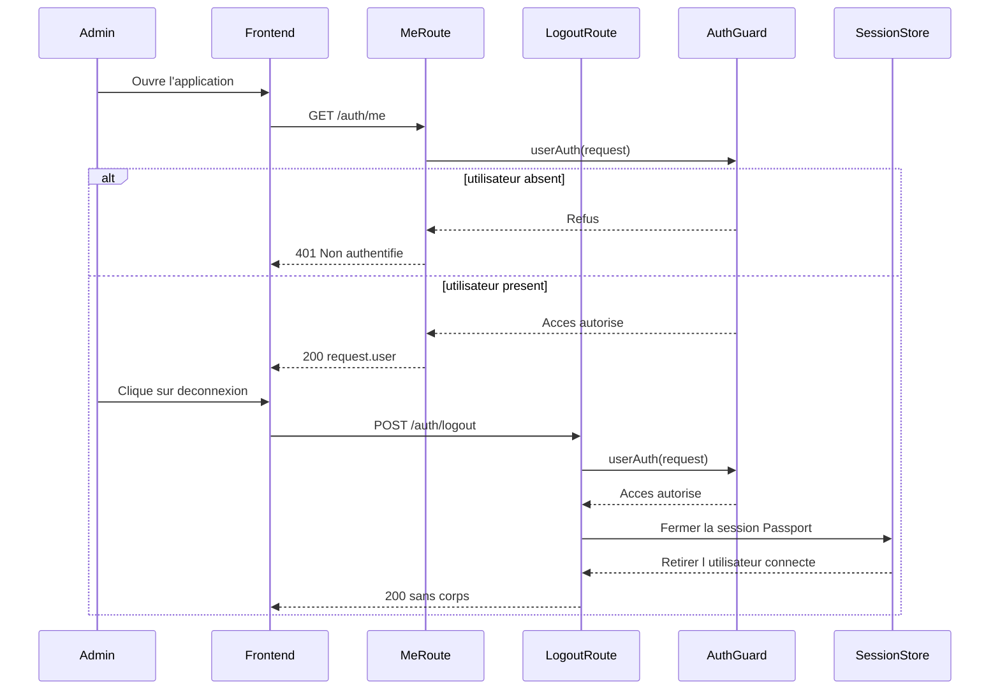

# Conception du module d'authentification

## 1. Objectif du module

Le module d'authentification permet de :

- connecter un utilisateur a partir de son courriel et de son mot de passe ;
- creer et restaurer une session serveur ;
- retourner l'utilisateur connecte ;
- deconnecter proprement l'utilisateur.

Dans le code actuel, les profils applicatifs pris en charge sont :

- `ADMIN`
- `RESPONSABLE`
- `ADMIN_RESPONSABLE` comme cumul technique des deux precedents

Regles a retenir :

- `Professeur` et `Etudiant` ne disposent pas de connexion applicative ;
- ils restent des entites metier gerees par les utilisateurs administratifs ;
- le frontend consomme actuellement les routes `/auth/login`, `/auth/me` et `/auth/logout`.

## 2. Perimetre technique reel

Ce document est aligne avec :

- `Backend/package.json`
- `Backend/src/server.js`
- `Backend/src/app.js`
- `Backend/auth.js`
- `Backend/routes/auth.routes.js`
- `Backend/middlewares/auth.js`
- `Backend/src/model/utilisateur.js`
- `Backend/src/utils/passwords.js`
- `Frontend/src/services/auth.api.js`
- `Backend/Database/GDH5.sql`

## Statut actuel dans le projet

Le module d'authentification est bien branche dans le point d'entree principal du backend.

Autrement dit :

- `Backend/package.json` demarre `Backend/src/server.js` ;
- `Backend/src/server.js` charge `Backend/src/app.js` ;
- `Backend/src/app.js` enregistre `authRoutes(app)` ;
- une suite de tests couvre la configuration Passport et les routes dans `Backend/tests/auth.config.test.js` et `Backend/tests/auth.test.js`.

L'erreur visible dans l'aperçu Markdown venait des deux diagrammes Mermaid : leurs declarations de participants utilisaient des alias longs avec `/`, ce qui casse le rendu dans l'extension Mermaid `8.8.0`.

---

## 3. Structure de donnees utilisee

### Schema legacy encore present dans `Backend/Database/GDH5.sql`

| Champ | Type | Contraintes | Description |
|--------|--------|------------|------------|
| `id_utilisateur` | INT | PK, AUTO_INCREMENT | Identifiant technique legacy |
| `nom` | VARCHAR(100) | NOT NULL | Nom |
| `prenom` | VARCHAR(100) | NOT NULL | Prenom |
| `email` | VARCHAR(150) | NOT NULL, UNIQUE | Identifiant de connexion |
| `motdepasse` | VARCHAR(255) | NOT NULL | Mot de passe bcrypt ou legacy |
| `role` | VARCHAR(50) | NOT NULL | Role applicatif legacy |

### Compatibilite geree par le backend

- `findByEmail()` essaie d'abord le schema moderne (`id`, `mot_de_passe_hash`, `actif`), puis bascule vers le schema legacy (`id_utilisateur`, `motdepasse`, `role`) ;
- `findById()` suit la meme logique de fallback ;
- `findRolesByUserId()` essaie d'abord `utilisateur_roles` et `roles`, puis relit `utilisateurs.role` si ces tables ne sont pas disponibles ;
- `verifyPassword()` compare d'abord avec `bcrypt`, puis garde un fallback transitoire pour les anciens mots de passe encore stockes en clair.

---

## 4. Diagramme UML de sequence du login

### Lecture du schema

- le frontend envoie les identifiants a `POST /auth/login` ;
- la route valide d'abord `email` et `password` ;
- la logique d'authentification passe par `passport.authenticate("local")` ;
- la recherche utilisateur est deleguee a `Backend/src/model/utilisateur.js` ;
- le mot de passe est verifie par `verifyPassword()` ;
- en cas de succes, `request.logIn()` serialize l'identifiant utilisateur en session ;
- le frontend appelle ensuite `GET /auth/me` pour recuperer l'utilisateur complet.

---

## 5. Diagramme UML de sequence de la session

### Lecture du schema

- `GET /auth/me` passe d'abord par `userAuth` ;
- `userAuth` accepte `req.user` ou `req.session.user` ;
- si l'utilisateur est authentifie, la route retourne directement `request.user` ;
- `POST /auth/logout` appelle `request.logOut()` ;
- le code ne fait pas explicitement `req.session.destroy()` ni `clearCookie("sid")`.

---

## 6. Regles metier

- `email` doit etre une chaine non vide ;
- `password` doit contenir au moins 6 caracteres ;
- `POST /auth/login` retourne `200` sans corps si la connexion reussit ;
- le frontend traduit `wrong_user` et `wrong_password` en message unique pour l'utilisateur ;
- `serializeUser()` stocke uniquement `user.id` en session ;
- `deserializeUser()` recharge l'utilisateur via `findById()` puis attache `roles` ;
- les middlewares de role lisent en priorite `user.roles`, puis savent encore traiter `user.role` pour compatibilite.

## 7. Point de vigilance de coherence

Le document precedent etait desynchronise du code sur trois points :

- il referencait `Backend/app.js`, alors que l'entree effective est `Backend/src/app.js` ;
- il decrivait un flux base sur `bcrypt` et `req.session.user`, alors que le flux reel passe par `Passport`, `request.logIn()` et `req.user` ;
- les deux diagrammes Mermaid utilisaient une syntaxe non compatible avec l'aperçu Mermaid `8.8.0`.

Le point de vigilance encore present dans le code est ailleurs :

- `Backend/src/app.js` commente `/api/auth/*`, mais les routes declarees et consommees sont `/auth/*` ;
- `verifyPassword()` conserve un fallback legacy pour les mots de passe encore stockes en clair.

---

## 8. Conclusion

L'authentification du projet repose sur quatre elements principaux :

- la validation d'entree dans les routes ;
- la strategie locale Passport ;
- le rechargement utilisateur via le modele ;
- la session restauree dans `req.user`.
