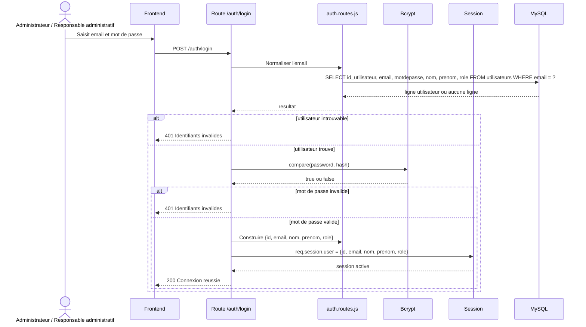
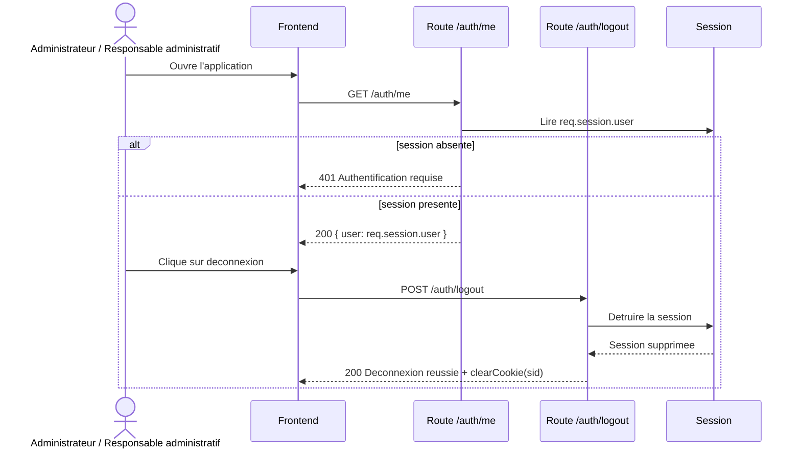

# Conception du module d'authentification

## 1. Objectif du module

Le module d'authentification permet de :

- connecter un utilisateur a partir de son courriel et de son mot de passe ;
- creer et conserver une session serveur ;
- retourner l'utilisateur connecte ;
- deconnecter proprement l'utilisateur.

Dans la conception cible du projet, **seuls deux types d'utilisateurs se connectent** :

- `Administrateur`
- `Responsable administratif`

Regles a retenir :

- `Professeur` et `Etudiant` ne disposent pas de connexion applicative ;
- ils restent des entites metier consultees et gerees par les utilisateurs administratifs ;
- si le depot expose encore `ADMIN_RESPONSABLE`, ce code doit etre interprete comme
  un alias technique transitoire du `Responsable administratif`, et non comme un troisieme profil fonctionnel.

Ce document est aligne avec :

- `Backend/app.js`
- `Backend/routes/auth.routes.js`
- `Backend/db.js`
- `Backend/Database/GDH5.sql`

## Statut actuel dans le projet

Le module d'authentification existe bien dans le depot, mais il est monte dans `Backend/app.js`, alors que le serveur principal lance par `Backend/package.json` demarre `Backend/src/server.js`, qui charge `Backend/src/app.js`.

Autrement dit :

- le module auth est bien implemente ;
- une suite de tests existe dans `Backend/tests/auth.test.js` ;
- mais il ne partage pas encore le meme point d'entree que les routes metier principales lancees par defaut.

---

## 2. Structure de donnees utilisee

### Table `utilisateurs`

| Champ | Type | Contraintes | Description |
|--------|--------|------------|------------|
| `id_utilisateur` | INT | PK, AUTO_INCREMENT | Identifiant technique |
| `nom` | VARCHAR(100) | NOT NULL | Nom |
| `prenom` | VARCHAR(100) | NOT NULL | Prenom |
| `email` | VARCHAR(150) | NOT NULL, UNIQUE | Identifiant de connexion |
| `motdepasse` | VARCHAR(255) | NOT NULL | Mot de passe hache |
| `role` | VARCHAR(50) | NOT NULL | Role applicatif |

---

## 3. Diagramme UML de sequence du login

### Lecture du schema

- le frontend envoie les identifiants a `POST /auth/login` ;
- la logique de route interroge directement MySQL via `pool.query` ;
- le mot de passe est valide avec `bcrypt` ;
- la session est creee uniquement si les controles passent.

---

## 4. Diagramme UML de sequence de la session

### Lecture du schema

- `GET /auth/me` verifie la presence de `req.session.user` ;
- si la session existe, l'utilisateur connecte est retourne ;
- `POST /auth/logout` detruit la session serveur.

---

## 5. Regles metier

- `email` et `password` sont obligatoires au login ;
- l'email est normalise en minuscules ;
- le mot de passe n'est jamais compare en clair ;
- le role expose au frontend provient du champ `utilisateurs.role` ;
- la session est stockee cote serveur avec `express-session` ;
- l'objet de session contient actuellement le champ `role`.

## Point de vigilance de coherence

Le middleware `authorize` lit `req.session.user.roles`, alors que la route de login stocke actuellement `req.session.user.role`.

En l'etat :

- les routes protegees par role existent bien dans le depot ;
- mais une session creee par `POST /auth/login` ne fournit pas la structure attendue par `authorize` ;
- un acces a `/admin-only` ou `/responsable-only` peut donc etre refuse malgre un role applicatif valide.

Ce document n'efface pas cet ecart : il le rend explicite pour eviter toute contradiction entre la conception et le code reellement present.

---

## 6. Conclusion

Les diagrammes montrent clairement que l'authentification repose sur trois elements principaux :

- la route de connexion ;
- la lecture de l'utilisateur en base ;
- la session serveur.
