# Conception de la base de donnees

## 1. Objectif

Ce document presente le schema relationnel global du projet **Gestion des horaires** a partir du fichier `Backend/Database/GDH5.sql`.

Il sert de reference pour comprendre :

- les entites principales ;
- les dependances entre les modules ;
- la structure utilisee par la planification des horaires.

---

## 2. Schema relationnel global

---

## 3. Lecture du schema

### 3.1 Entites de reference

- `cours`
- `professeurs`
- `salles`
- `utilisateurs`
- `groupes_etudiants`
- `plages_horaires`

### 3.2 Entites de planification

- `affectation_cours` : associe un cours, un professeur, une salle et une plage horaire.
- `affectation_groupes` : relie un ou plusieurs groupes a une affectation.

### 3.3 Sens des relations

- un **cours** peut etre planifie plusieurs fois ;
- un **professeur** peut enseigner plusieurs affectations ;
- une **salle** peut etre utilisee dans plusieurs affectations ;
- une **plage horaire** positionne une affectation dans le temps ;
- un **groupe d'etudiants** peut etre relie a plusieurs affectations.

---

## 4. Conclusion

Le coeur du systeme repose sur `affectation_cours`, qui agit comme table pivot de planification, et `affectation_groupes`, qui relie cette planification aux groupes d'etudiants. Ce schema doit servir de base commune a toutes les autres conceptions.
