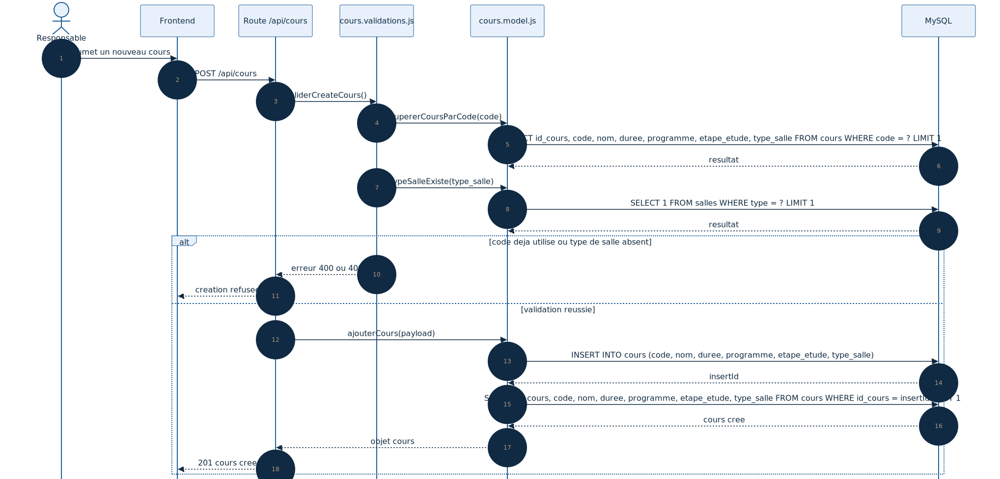

# Conception du module de gestion des cours

## 1. Objectif du module

Le module Cours gere le catalogue academique utilise dans la planification :

- creation ;
- consultation ;
- modification ;
- suppression sous contrainte metier.

Ce document est aligne avec :

- `Backend/routes/cours.routes.js`
- `Backend/src/validations/cours.validations.js`
- `Backend/src/model/cours.model.js`
- `Backend/Database/GDH5.sql`

## Statut actuel dans le projet

Le module Cours est effectivement actif dans le backend principal lance par defaut, via `Backend/src/app.js`.

La dependance avec `affectation_cours` existe deja dans le schema SQL, meme si la planification complete n'est pas encore branchee dans le meme point d'entree.

---

## 2. Diagramme UML de classes

### Lecture du schema

- `Cours` contient les donnees de reference du catalogue ;
- `AffectationCours` reutilise un cours lors de la planification ;
- la relation explique la contrainte sur la suppression d'un cours deja planifie.

---

## 3. Diagramme UML de sequence de creation

### Lecture du schema

- la route declenche les validations metier ;
- le backend verifie l'unicite du code ;
- le type de salle demande est valide ;
- le cours est insere seulement si les controles reussissent.

---

## 4. Structure de donnees

### Table `cours`

| Champ | Type | Contraintes | Description |
|--------|--------|------------|------------|
| `id_cours` | INT | PK, AUTO_INCREMENT | Identifiant technique |
| `code` | VARCHAR(50) | NOT NULL, UNIQUE | Code du cours |
| `nom` | VARCHAR(150) | NOT NULL | Intitule |
| `duree` | INT | NOT NULL | Duree |
| `programme` | VARCHAR(150) | NOT NULL | Programme cible |
| `etape_etude` | VARCHAR(50) | NOT NULL | Etape d'etude |
| `type_salle` | VARCHAR(50) | NOT NULL | Type de salle requis |
| `archive` | TINYINT(1) | NOT NULL, DEFAULT 0 | Indicateur d'archivage |

---

## 5. Regles metier

- le `code` est unique ;
- `nom`, `programme` et `type_salle` sont obligatoires ;
- `duree` doit etre strictement positive ;
- `etape_etude` est controlee par les validations backend ;
- un cours deja present dans `affectation_cours` ne doit pas etre supprime.

---

## 6. Conclusion

Le module Cours fournit les donnees de reference de la planification. Les diagrammes montrent que la gestion CRUD n'est pas isolee : elle depend directement de l'usage reel du cours dans les affectations.
