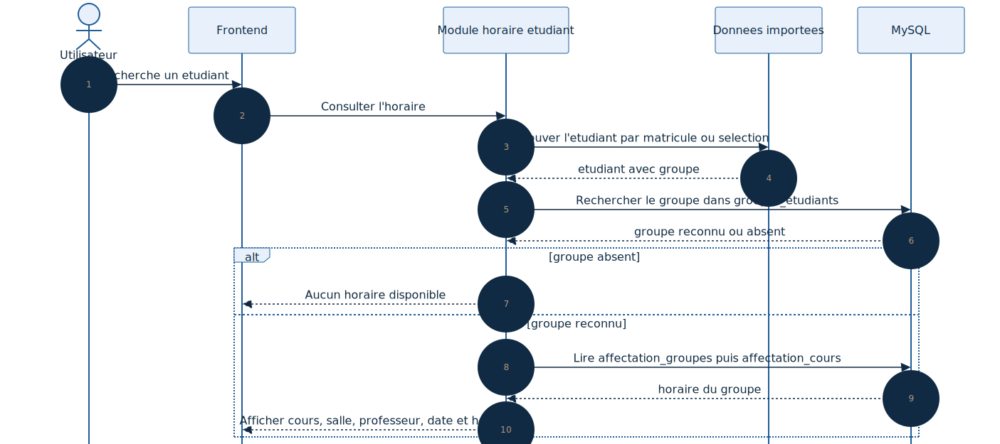

# Conception - Horaire etudiant

## 1. Objectif

Ce document presente la conception fonctionnelle du module de consultation de l'horaire etudiant.

Le principe central est le suivant :

- l'etudiant provient d'un import ;
- le groupe sert de pivot ;
- l'horaire affiche est celui du groupe auquel l'etudiant appartient.

## Statut actuel dans le projet

Le besoin est decrit dans le cahier des charges et la structure de planification existe deja dans `Backend/Database/GDH5.sql`, mais le module complet d'horaire etudiant n'est pas encore branche dans l'entree backend principale.

Les schemas ci-dessous decrivent donc la conception cible la plus coherente avec le projet.

---

## 2. Diagramme UML de classes

### Lecture du schema

- l'etudiant importe porte les donnees de recherche ;
- le groupe reste le pivot entre l'etudiant et l'horaire ;
- `AffectationGroupes` relie le groupe a une affectation de cours deja planifiee.

---

## 3. Diagramme UML de sequence de consultation

### Lecture du schema

- l'utilisateur recherche un etudiant ;
- le systeme retrouve son groupe depuis les donnees importees ;
- le backend interroge ensuite les groupes et les affectations ;
- l'horaire affiche correspond au groupe reconnu dans le systeme.

---

## 4. Relation principale

La relation principale du module est :

**Etudiant -> Groupe -> Horaire**

Cela signifie que le systeme ne cree pas un horaire etudiant par etudiant. Le systeme recupere l'horaire associe au groupe auquel l'etudiant appartient.

---

## 5. Donnees necessaires

### Donnees etudiant

- matricule
- nom
- prenom
- groupe
- programme
- etape

### Donnees d'horaire

- groupe
- cours
- professeur
- salle
- date
- heure de debut
- heure de fin

---

## 6. Conclusion

La conception du module repose sur une logique simple :

- les etudiants viennent d'un fichier Excel ;
- chaque etudiant possede un matricule et un groupe ;
- le groupe sert de lien avec l'horaire ;
- le systeme affiche ensuite l'horaire de maniere claire.
