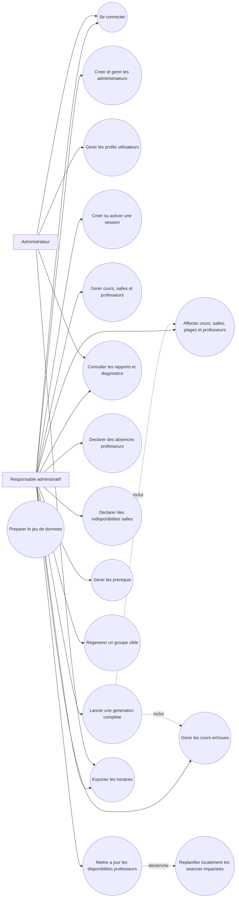
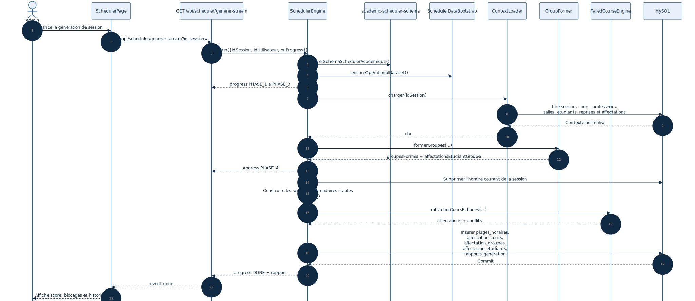
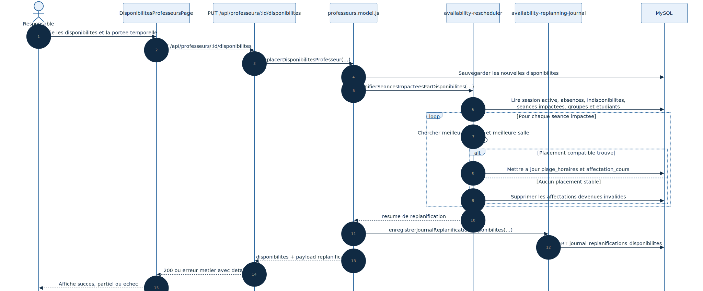

# Conception bout en bout du moteur intelligent de planification

## 1. Objectif du scheduler

Le moteur intelligent de planification est le sous-systeme qui produit,
reconstruit et explique l'horaire academique d'une session.

Il ne se limite pas a creer des affectations :

- il assure le schema minimal requis au runtime ;
- il peut completer un jeu de donnees academique operationnel ;
- il charge le contexte pedagogique et logistique de la session ;
- il forme des groupes reels par `programme + etape` ;
- il genere une semaine type stable repliquee sur toute la session ;
- il rattache les cours echoues a des groupes reels deja planifies ;
- il calcule un score qualite et persiste un rapport metier exploitable ;
- il alimente les flux annexes de regeneration ciblee et de replanification locale.

Le present document est aligne avec :

- `Backend/routes/scheduler.routes.js`
- `Backend/routes/groupes.routes.js`
- `Backend/routes/professeurs.routes.js`
- `Backend/src/services/scheduler/SchedulerEngine.js`
- `Backend/src/services/scheduler/SchedulerDataBootstrap.js`
- `Backend/src/services/scheduler/ContextLoader.js`
- `Backend/src/services/scheduler/GroupFormer.js`
- `Backend/src/services/scheduler/ConstraintMatrix.js`
- `Backend/src/services/scheduler/AvailabilityChecker.js`
- `Backend/src/services/scheduler/FailedCourseEngine.js`
- `Backend/src/services/scheduler/SchedulerReportService.js`
- `Backend/src/services/academic-scheduler-schema.js`
- `Backend/src/services/professeurs/availability-rescheduler.js`
- `Frontend/src/pages/SchedulerPage.jsx`
- `Frontend/src/pages/DisponibilitesProfesseursPage.jsx`

## 2. Perimetre fonctionnel

Le scheduler couvre les flux suivants :

- bootstrap academique et operationnel ;
- gestion des sessions cibles ;
- generation complete d'une session via `/api/scheduler` ;
- diffusion de l'avancement via SSE ;
- consultation d'historique et lecture de rapports enrichis ;
- gestion des reprises via `cours_echoues` ;
- gestion des absences professeurs et des indisponibilites salles ;
- gestion des prerequis de cours ;
- generation ciblee par groupe via `/api/groupes` ;
- replanification locale quand les disponibilites d'un professeur changent.

Le scheduler doit etre distingue de la planification standard exposee sous
`/api/horaires` :

- le module standard est un CRUD transactionnel centre sur l'affectation ;
- le scheduler est un orchestrateur multi-etapes centre sur la session ;
- le scheduler reconstruit un motif recurrent et produit des diagnostics ;
- le scheduler manipule explicitement les reprises, les rapports et les
  ajustements locaux.

## 3. Acteurs et cas d'usage

Lecture du diagramme :

- seuls deux acteurs se connectent : `Administrateur` et `Responsable administratif` ;
- le `Responsable administratif` pilote la session, le bootstrap, la generation complete
  et les objets de contrainte ;
- l'`Administrateur` reste un acteur administratif delegue, sans devenir un
  acteur de gouvernance globale ;
- `Professeur` et `Etudiant` ne sont pas des acteurs authentifies du systeme ;
- la mise a jour des disponibilites professeurs prolonge le scheduler par
  une replanification locale au lieu de casser silencieusement l'horaire ;
- le rapport de generation est un livrable fonctionnel, pas un simple log.

## 4. Positionnement dans l'architecture

### 4.1 Vue composants

La decomposition reelle du projet suit cinq couches :

- presentation : `SchedulerPage` et `DisponibilitesProfesseursPage` ;
- exposition API : `scheduler.routes.js`, `groupes.routes.js`,
  `professeurs.routes.js` ;
- orchestration : `SchedulerEngine` et `SchedulerDataBootstrap` ;
- domaine : `ContextLoader`, `GroupFormer`, `ConstraintMatrix`,
  `AvailabilityChecker`, `FailedCourseEngine` ;
- persistence et lecture metier : MySQL, `SchedulerReportService`,
  `availability-rescheduler` et le journal de replanification.

### 4.2 Vue deploiement logique

La solution repose sur un deploiement web classique mais avec deux canaux :

- REST pour les operations de gestion ;
- SSE pour suivre les phases de generation longue depuis le navigateur.

Le moteur intelligent est donc embarque dans le meme backend Express que le
reste de l'application, sans worker externe ni ordonnanceur dedie dans l'etat
actuel du depot.

## 5. Pipeline de generation complete

### 5.1 Vue activite

### 5.2 Vue sequence

### 5.3 Etapes reelles

#### Etape 0 - Preparation technique

Avant toute generation, `SchedulerEngine.generer` execute :

- `assurerSchemaSchedulerAcademique()` ;
- `SchedulerDataBootstrap.ensureOperationalDataset()`.

La premiere operation garantit la presence des evolutions techniques
indispensables :

- table `affectation_etudiants` ;
- index `uniq_groupes_session_nom` sur `groupes_etudiants` ;
- colonne `id_groupe_reprise` et contrainte associee sur `cours_echoues`.

La seconde operation assure un dataset academique minimal :

- session active si aucune session n'existe ;
- programmes de reference ;
- salles ;
- cours du catalogue academique ;
- professeurs et associations `professeur_cours` ;
- disponibilites professeurs ;
- groupes sources et etudiants de bootstrap.

Le bootstrap est appele de facon non bloquante avant la generation complete :
une erreur de bootstrap est journalisee mais ne bloque pas necessairement le
moteur si le jeu de donnees est deja exploitable.

#### Etape 1 - Chargement du contexte

`ContextLoader.charger()` construit le contexte de travail de la session :

- session cible ou session active ;
- saison normalisee ;
- cours non archives ;
- professeurs et leurs `cours_ids` ;
- salles ;
- etudiants filtres sur la session ;
- groupes de la session ;
- disponibilites et absences professeurs ;
- indisponibilites de salles ;
- affectations existantes de la session ;
- cours echoues planifiables ;
- prerequis.

La session est obligatoire. Sans session, le moteur doit s'arreter proprement.

#### Etape 2 - Formation des groupes reels

`GroupFormer.formerGroupes()` segmente les etudiants par
`programme + etape` puis calcule :

- un nombre de groupes suffisant pour l'effectif regulier ;
- une reserve de capacite pour les reprises a absorber ;
- un `effectif_projete_max` par groupe ;
- une `charge_estimee_par_cours` quand un cours attire des reprises.

Le moteur ne planifie donc pas seulement des cohortes actuelles ; il planifie
des groupes projetes qui doivent rester viables apres rattachement des reprises.

#### Etape 3 - Construction de la matrice de contraintes

`ConstraintMatrix` centralise les conflits en memoire pour eviter des lectures
SQL repetitives pendant la generation.

Les verifications portent sur :

- occupation des salles ;
- occupation des professeurs ;
- occupation des groupes ;
- occupation des etudiants ;
- charge hebdomadaire des groupes ;
- charge hebdomadaire des professeurs ;
- nombre de cours distincts par professeur ;
- nombre de groupes distincts par professeur.

Cette matrice est enrichie au fur et a mesure des placements retenus.

#### Etape 4 - Generation de la semaine type stable

Le moteur ne raisonne pas seance par seance isolee.

Il cherche une serie recurrente composee de :

- un jour de semaine ;
- un creneau ;
- un professeur ;
- une salle ou un mode en ligne ;
- une repetition sur toutes les semaines admissibles de la session.

La recherche principale applique une logique de couverture :

- seuil de couverture principale a `60%` des dates d'un meme jour ;
- filtrage date par date au lieu de rejeter toute la serie au premier echec ;
- bonus de score quand le placement colle a une preference historique ;
- priorite aux groupes et professeurs les moins charges ;
- respect du plafond quotidien et hebdomadaire.

Ce mecanisme est la cle de la stabilite du scheduler : le systeme prefere un
motif stable incomplet mais robuste a un ensemble de placements fragiles.

#### Etape 4B - Passe assouplie

Si la recherche principale echoue, le moteur lance
`_trouverSerieAssouplie()` avec une strategie de secours qui conserve le mode du cours :

- presentiel assoupli si le cours est presentiel et qu'une salle reste disponible ;
- entierement en ligne si le cours est explicitement marque en ligne ;
- jamais de bascule automatique d'un cours presentiel vers l'en ligne.

La couverture minimale descend a `40%`.

Le mode en ligne est donc une propriete metier du cours, pas une conversion
technique de derniere minute.

#### Etape 4C - Garantie metier de 7 cours

Apres les deux passes precedentes, `_passeDeGarantieGroupes()` identifie les
groupes qui n'atteignent pas la cible hebdomadaire.

La cible structurelle est :

- `REQUIRED_WEEKLY_SESSIONS_PER_GROUP = 7`.

Le moteur tente alors d'ajouter des cours manquants via la passe assouplie.
Si cela reste impossible, il genere un diagnostic prefixe par `GARANTIE_...`.

#### Etape 5 - Traitement des cours echoues

`FailedCourseEngine.rattacherCoursEchoues()` ne cree pas de groupes speciaux
dans le flux principal courant. Il tente plutot de rattacher chaque etudiant
en reprise a une section reelle deja planifiee.

Les controles portent sur :

- existence de sections reelles pour le cours ;
- capacite operationnelle restante ;
- absence de conflit avec l'horaire principal ;
- prise en charge ou non des sections en ligne.

Les reprises retenues sont reservees dans la matrice et persistees ensuite dans
`affectation_etudiants`.

#### Etape 6 - Evaluation qualite

`SimulatedAnnealing` existe dans le depot, mais le flux principal du moteur ne
l'utilise pas pour modifier la solution finale.

Le score qualite calcule par `_calculerScoreQualite()` penalise notamment :

- les cours non planifies ;
- les resolutions manuelles ;
- les seances hors semaine de travail ;
- les groupes hors plage de jours actifs ;
- les surcharges quotidiennes ;
- les groupes sous la cible hebdomadaire ;
- la perte de stabilite par rapport a l'historique disponible.

#### Etape 7 - Persistance transactionnelle

La generation complete fonctionne dans une transaction SQL unique.

Elle execute notamment :

- suppression de l'horaire courant de la session cible ;
- persistence ou mise a jour des groupes ;
- mise a jour de l'appartenance des etudiants ;
- insertion des `plages_horaires` ;
- insertion des `affectation_cours` ;
- insertion des `affectation_groupes` ;
- insertion des `affectation_etudiants` pour les reprises ;
- mise a jour du statut des `cours_echoues` ;
- insertion d'une entree dans `rapports_generation`.

Si une etape echoue, le moteur annule la transaction complete.

## 6. Flux annexes relies au scheduler

### 6.1 Generation ciblee par groupe

`SchedulerEngine.genererGroupe()` est expose indirectement par :

- `POST /api/groupes/generer-cible`
- `POST /api/groupes/:id/generer-horaire`

Cette generation :

- ne supprime que les affectations du groupe cible ;
- recharge les contraintes globales des autres groupes pour eviter les conflits ;
- integre les reprises deja rattachees a ce groupe ;
- ne reconstitue pas de preference de stabilite historique ;
- ne persiste pas d'entree dans `rapports_generation` dans l'etat actuel.

Il s'agit donc d'un flux d'ajustement local, pas d'un recalcul institutionnel.

### 6.2 Replanification locale apres changement de disponibilites

Quand les disponibilites d'un professeur sont modifiees, le module
`professeurs.model.js` appelle
`replanifierSeancesImpacteesParDisponibilites()`.

Le service :

- identifie les seances futures qui ne sont plus couvertes ;
- cherche un nouveau creneau compatible avec les groupes, la salle et la
  disponibilite du professeur ;
- privilegie la meme semaine puis les semaines suivantes ;
- met a jour les seances replacables ;
- retire de l'horaire valide les seances impossibles a replacer ;
- journalise l'operation dans `journal_replanifications_disponibilites`.

Ce flux est volontairement local : il tente de minimiser l'impact sans relancer
la generation complete de session.

## 7. Composants coeur du moteur

### `SchedulerEngine`

Role :

- orchestrer la generation complete et ciblee ;
- diffuser la progression ;
- evaluer la qualite ;
- persister les affectations et les rapports.

### `SchedulerDataBootstrap`

Role :

- assurer qu'une session, un catalogue, des salles, des professeurs et des
  disponibilites minimales existent ;
- maintenir un dataset de reference coherent avec le catalogue academique.

### `ContextLoader`

Role :

- fournir un contexte de session complet et normalise ;
- filtrer les etudiants par saison/session ;
- preparer les index de disponibilites, absences, indisponibilites et reprises.

### `GroupFormer`

Role :

- former les groupes reels de travail ;
- projeter la charge de reprises dans les capacites cibles.

### `ConstraintMatrix`

Role :

- reserver et liberer les ressources en memoire ;
- verifier les conflits temporels et les plafonds.

### `AvailabilityChecker`

Role :

- centraliser la compatibilite professeur/cours et salle/cours ;
- verifier disponibilites, absences et indisponibilites.

### `FailedCourseEngine`

Role :

- rattacher les cours echoues a des groupes reels ;
- produire des raisons de conflit explicites quand le rattachement echoue.

### `SchedulerReportService`

Role :

- lire l'historique ;
- enrichir les rapports avec contexte metier, ressources compatibles et actions
  manuelles suggerees.

## 8. Modele de donnees

Le modele de donnees du scheduler s'articule autour de quatre blocs.

### 8.1 Pilotage et contraintes

- `sessions`
- `prerequis_cours`
- `disponibilites_professeurs`
- `absences_professeurs`
- `salles_indisponibles`

### 8.2 Ressources academiques

- `cours`
- `professeurs`
- `professeur_cours`
- `salles`
- `groupes_etudiants`
- `etudiants`

### 8.3 Execution de planning

- `plages_horaires`
- `affectation_cours`
- `affectation_groupes`
- `affectation_etudiants`

### 8.4 Diagnostic et historisation

- `cours_echoues`
- `rapports_generation`
- `journal_replanifications_disponibilites`

Deux particularites sont structurantes :

- le nom de groupe est rendu unique par session et non plus globalement ;
- `rapports_generation.details` et le journal de replanification stockent des
  structures JSON riches pour l'analyse metier.

## 9. Regles metier structurantes

- une generation complete doit toujours etre attachee a une session active ou
  explicite ;
- le moteur force actuellement `weekendAutorise = false`, meme si le payload
  expose `inclure_weekend` ;
- la semaine type vise `7` cours et `3 a 4` jours actifs par groupe ;
- un groupe ne doit pas depasser `3` seances par jour ;
- un professeur ne doit pas depasser `4` seances par jour ;
- les plafonds hebdomadaires et de portefeuille professeur combinent des
  constantes du catalogue et des variables d'environnement ;
- `professeur_cours` est la source de verite pour la compatibilite
  professeur/cours ; a defaut, la specialite texte sert de fallback ;
- les cours en ligne sont actives par defaut et ne peuvent etre coupes que par
  un rollback explicite ;
- les reprises privilegient les groupes reels existants plutot que des groupes
  dedies ;
- le rapport final doit expliquer les echecs et proposer une action manuelle
  plausible.

## 10. Invariants architecturaux

- la generation complete est transactionnelle ;
- la generation ciblee doit rester localisee a un groupe ;
- une seance invalide ne doit pas rester dans l'horaire valide apres une
  replanification en echec ;
- les diagnostics metier doivent etre persistables et relisibles apres coup ;
- la stabilite hebdomadaire prime sur une optimisation locale aggressive.

## 11. Points de vigilance

- `sa_params` est recu par l'API mais le recuit simule est neutralise dans le
  flux final ;
- la qualite depend fortement des associations `professeur_cours`, des salles
  et des disponibilites ;
- le bootstrap peut modifier ou archiver des donnees de reference pour rendre
  l'environnement coherent ;
- `assurerSchemaSchedulerAcademique()` est desactive en environnement de test,
  ce qui est utile pour l'isolation mais masque la migration runtime ;
- la generation ciblee n'inscrit pas de rapport dans `rapports_generation` ;
- la replanification locale peut retirer des seances de l'horaire si aucune
  solution compatible n'existe.

## 12. Conclusion

Le scheduler du projet est un moteur academique transactionnel construit autour
de la stabilite d'une semaine type, de la gestion explicite des contraintes et
de la production de diagnostics metier persistants.

Sa valeur architecturale ne vient pas d'un algorithme unique, mais de
l'orchestration coherente entre :

- schema runtime ;
- bootstrap academique ;
- segmentation en groupes reels ;
- reservation de ressources ;
- gestion des reprises ;
- lecture de rapports et replanification locale.
