# Conception du moteur intelligent de planification

## 1. Objectif

Le moteur intelligent de planification est le coeur decisionnel du projet.

Il a pour role de :

- charger le contexte academique de la session cible ;
- former ou reajuster les groupes reels ;
- reserver un motif hebdomadaire stable pour chaque cours ;
- traiter les reprises issues des cours echoues ;
- evaluer la qualite de la solution ;
- persister les affectations et les rapports d'execution.

Le module de reference est compose principalement de :

- `Backend/routes/scheduler.routes.js`
- `Backend/src/services/scheduler/SchedulerEngine.js`
- `Backend/src/services/scheduler/ContextLoader.js`
- `Backend/src/services/scheduler/GroupFormer.js`
- `Backend/src/services/scheduler/ConstraintMatrix.js`
- `Backend/src/services/scheduler/FailedCourseEngine.js`
- `Backend/src/services/scheduler/SchedulerReportService.js`

## 2. Positionnement dans l'architecture

Le moteur intelligent n'est pas un simple CRUD d'affectations.

Il orchestre plusieurs sous-systemes :

- le bootstrap academique ;
- la lecture des donnees metier de la session ;
- la modelisation des contraintes en memoire ;
- la generation recurrente des seances ;
- l'affectation des reprises et les diagnostics ;
- la persistance transactionnelle ;
- l'historisation des rapports.

```mermaid
flowchart LR
    A[API Scheduler] --> B[Schema + Bootstrap]
    B --> C[ContextLoader]
    C --> D[GroupFormer]
    D --> E[ConstraintMatrix]
    E --> F[Generation hebdomadaire]
    F --> G[Passes de recuperation]
    G --> H[FailedCourseEngine]
    H --> I[Evaluation qualite]
    I --> J[Persistance + rapports]
```

## 3. Entrees metier

Le moteur travaille sur une session academique active ou explicite.

Les entrees principales sont :

- `sessions`
- `cours`
- `professeurs`
- `professeur_cours`
- `disponibilites_professeurs`
- `absences_professeurs`
- `salles`
- `salles_indisponibles`
- `etudiants`
- `groupes_etudiants`
- `cours_echoues`
- `prerequis_cours`
- `affectations` deja existantes de la session

Les parametres d'execution sont :

- `id_session`
- `id_utilisateur`
- `inclure_weekend` ; le code force actuellement le mode sans weekend
- `sa_params`
- `onProgress` pour le flux SSE

## 4. Pipeline reel du moteur

### 4.1 Preparation du schema

Avant toute generation, le module appelle `assurerSchemaSchedulerAcademique`.

Cette couche garantit la presence ou l'evolution de structures indispensables :

- `affectation_etudiants`
- clefs et index sur `groupes_etudiants`
- colonnes et contraintes de `cours_echoues`

### 4.2 Bootstrap operationnel

Le moteur appelle ensuite `SchedulerDataBootstrap.ensureOperationalDataset`.

Cette etape cree ou complete au besoin :

- sessions ;
- catalogue de cours academiques ;
- professeurs et associations cours-professeurs ;
- salles ;
- disponibilites standards.

### 4.3 Chargement du contexte

`ContextLoader.charger` lit tout le contexte de la session cible.

La sortie contient :

- la session ;
- la saison normalisee ;
- les cours actifs ;
- les professeurs et leurs cours autorises ;
- les salles ;
- les etudiants filtres sur la session ;
- les groupes de la session ;
- les disponibilites, absences et indisponibilites ;
- les affectations existantes ;
- les cours echoues indexees par etudiant ;
- les prerequis.

### 4.4 Formation des groupes

`GroupFormer.formerGroupes` reconstruit les groupes reels par segment
`programme + etape`.

La logique reserve aussi une charge projetee pour les reprises a absorber,
afin que les groupes reels restent capacitaires apres rattachement des cours echoues.

### 4.5 Matrice de contraintes

`ConstraintMatrix` construit des index de reservation en memoire.

Les ressources verifiees sont :

- salles ;
- professeurs ;
- groupes ;
- etudiants ;
- charge hebdomadaire des groupes ;
- charge hebdomadaire des professeurs ;
- nombre de cours distincts par professeur ;
- nombre de groupes suivis par professeur.

### 4.6 Generation hebdomadaire recurrente

Le moteur ne choisit pas une date isolee pour chaque seance.

Il construit d'abord une serie hebdomadaire stable :

- choix d'un jour de semaine ;
- choix d'un creneau horaire ;
- choix d'un professeur ;
- choix d'une salle ;
- replication de cette combinaison sur toutes les semaines de la session.

Cette strategie garantit un horaire lisible et stable.

### 4.7 Passes de recuperation

Apres la passe principale, le moteur execute deux corrections :

- `Phase 4B` : recherche assouplie pour les cours encore non planifies ;
- `Phase 4C` : passe de garantie pour rapprocher chaque groupe du volume cible de `7` cours hebdomadaires.

### 4.8 Traitement des cours echoues

`FailedCourseEngine.rattacherCoursEchoues` tente de rattacher chaque etudiant
en reprise a une section reelle deja planifiee.

Le moteur :

- indexe les sections reelles par cours ;
- verifie la capacite restante ;
- verifie l'absence de conflit avec l'horaire principal de l'etudiant ;
- reserve les placements individuels dans la matrice ;
- produit des conflits riches si aucun rattachement n'est possible.

### 4.9 Evaluation de la qualite

Le module `SimulatedAnnealing` existe dans le depot, mais `SchedulerEngine`
neutralise actuellement son utilisation pour proteger la stabilite du motif hebdomadaire.

L'evaluation finale repose donc sur :

- le nombre de cours non planifies ;
- le nombre de resolutions manuelles ;
- le respect de la charge hebdomadaire ;
- la repartition des jours ;
- le taux de stabilite par rapport aux affectations de reference.

### 4.10 Persistance transactionnelle

La generation se fait dans une transaction SQL.

Les ecritures principales sont :

- nettoyage de l'horaire de la session cible ;
- persistence des groupes ;
- mise a jour des etudiants vers leurs groupes ;
- insertion des `plages_horaires` ;
- insertion des `affectation_cours` ;
- insertion des `affectation_groupes` ;
- persistence des rattachements individuels pour les reprises ;
- ecriture de `rapports_generation`.

## 5. Sorties du moteur

La sortie metier contient notamment :

- `score_qualite`
- `score_initial`
- `nb_cours_planifies`
- `nb_cours_non_planifies`
- `nb_cours_echoues_traites`
- `nb_cours_en_ligne_generes`
- `nb_resolutions_manuelles`
- `affectations`
- `non_planifies`
- `resolutions_manuelles`
- `groupes_crees`
- `details.qualite`
- `details.reprises`

## 6. Contraintes metier structurantes

- une session cible doit exister ;
- les etudiants sont filtres par session academique ;
- les conflits temporels sont interdits pour salle, professeur, groupe et etudiant ;
- un professeur ne peut depasser ses plafonds de charge ;
- un groupe doit tendre vers 7 cours hebdomadaires ;
- le weekend n'est pas utilise par le moteur actuel ;
- les cours en ligne ne sont autorises que si `ENABLE_ONLINE_COURSES` est active ;
- les reprises privilegient des groupes reels deja planifies plutot que des groupes speciaux.

## 7. Points de vigilance

- Le moteur modifie les groupes et les horaires de la session cible.
- Le module de recuit simule est present mais volontairement desactive dans le flux final.
- La qualite de sortie depend fortement de la qualite des associations `professeur_cours`, des disponibilites et du catalogue de salles.
- Les rapports servent a expliquer les echecs, pas seulement a compter les succes.

## 8. Conclusion

Le moteur intelligent du projet est un orchestrateur transactionnel multi-etapes.

Sa valeur vient de la combinaison suivante :

- segmentation academique rigoureuse ;
- gestion explicite des contraintes ;
- traitement des reprises ;
- diagnostics persistants ;
- stabilite d'un motif recurrent sur toute la session.
