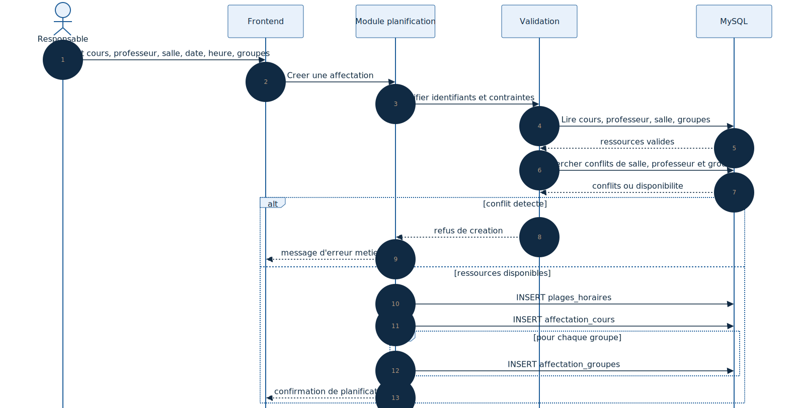

# Conception de la planification des horaires

## 1. Objectif

La planification relie les principales ressources du projet :

- un cours ;
- un professeur ;
- une salle ;
- une plage horaire ;
- un ou plusieurs groupes d'etudiants.

Ce document formalise la structure cible de cette fonctionnalite a partir du schema SQL du projet.

## Statut actuel dans le projet

La structure SQL de planification est bien presente dans `Backend/Database/GDH5.sql`, mais les routes backend actives du projet ne branchent pas encore ce module dans l'application principale. Les schemas ci-dessous decrivent donc la conception cible alignee avec :

- le cahier des charges ;
- le schema relationnel deja cree ;
- l'orientation fonctionnelle du projet.

---

## 2. Diagramme UML de classes de la planification

### Lecture du schema

- `AffectationCours` est l'entite centrale de la planification ;
- elle depend de `Cours`, `Professeur`, `Salle` et `PlageHoraire` ;
- `AffectationGroupes` relie ensuite l'affectation aux groupes d'etudiants.

---

## 3. Diagramme UML de sequence de creation d'une affectation

### Lecture du schema

- le responsable selectionne les ressources necessaires ;
- le backend controle l'existence des donnees ;
- les conflits potentiels sont verifies ;
- la plage horaire, l'affectation et les associations de groupes sont ensuite enregistrees.

---

## 4. Regles metier attendues

- une affectation doit referencer des ressources existantes ;
- une salle ne doit pas etre reservee a deux cours au meme moment ;
- un professeur ne doit pas etre affecte a deux cours simultanes ;
- un groupe ne doit pas suivre deux cours sur le meme creneau ;
- l'horaire d'un etudiant decoule du groupe auquel il appartient.

---

## 5. Conclusion

La planification est le point de convergence du systeme. Les deux diagrammes integres donnent une vue claire de sa structure et de son deroulement metier.
