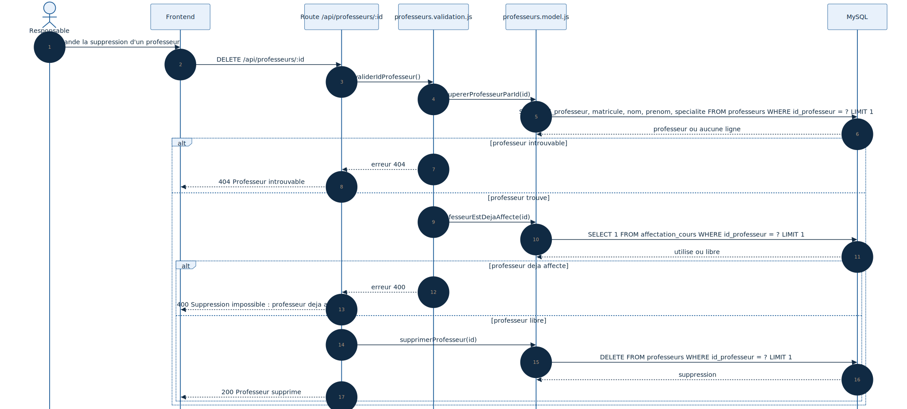

# Conception du module de gestion des professeurs

## 1. Objectif du module

Le module professeurs permet de :

- creer un professeur ;
- consulter la liste des professeurs ;
- modifier un professeur existant ;
- supprimer un professeur seulement s'il n'est pas deja utilise dans une affectation.

Ce document est aligne avec :

- `Backend/routes/professeurs.routes.js`
- `Backend/src/validations/professeurs.validation.js`
- `Backend/src/model/professeurs.model.js`
- `Backend/Database/GDH5.sql`

## Statut actuel dans le projet

Le module Professeurs est effectivement actif dans le backend principal lance par defaut, via `Backend/src/app.js`.

La relation avec `affectation_cours` existe deja au niveau base de donnees, meme si la planification complete n'est pas encore branchee dans le meme point d'entree.

---

## 2. Diagramme UML de classes

### Lecture du schema

- la classe metier principale est `Professeur` ;
- `AffectationCours` depend de `Professeur` via `id_professeur` ;
- cette relation explique pourquoi la suppression doit etre controlee.

---

## 3. Diagramme UML de sequence de suppression

### Lecture du schema

- l'identifiant est valide ;
- le professeur est recherche en base ;
- le backend verifie s'il est deja utilise dans `affectation_cours` ;
- la suppression n'a lieu que si aucune affectation ne le reference.

---

## 4. Structure de donnees

### Table `professeurs`

| Champ | Type | Contraintes | Description |
|--------|--------|------------|------------|
| `id_professeur` | INT | PK, AUTO_INCREMENT | Identifiant technique |
| `matricule` | VARCHAR(50) | NOT NULL, UNIQUE | Identifiant metier |
| `nom` | VARCHAR(100) | NOT NULL | Nom |
| `prenom` | VARCHAR(100) | NOT NULL | Prenom |
| `specialite` | VARCHAR(100) | NULL | Specialite |

---

## 5. Regles metier

- le `matricule` est unique ;
- `nom` et `prenom` sont obligatoires ;
- `specialite` est facultative ;
- un professeur deja lie a une affectation ne doit pas etre supprime.

---

## 6. Conclusion

Le module professeurs alimente directement la planification. Les diagrammes montrent que sa coherence depend de la relation entre la fiche professeur et les affectations existantes.
