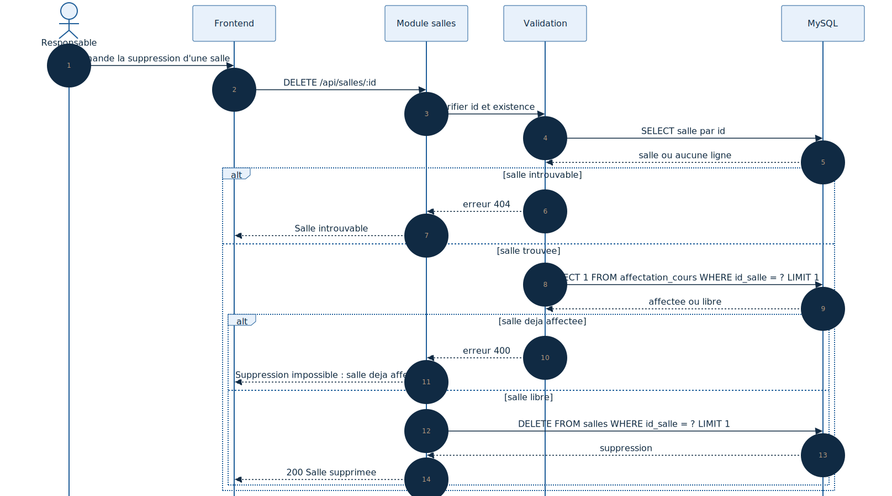

# Conception du module de gestion des salles

## 1. Objectif du module

Le module de gestion des salles permet la creation, la consultation, la modification et la suppression des salles dans le systeme de gestion des horaires.

Il constitue une entite essentielle utilisee dans la planification academique et l'affectation des ressources.

## Statut actuel dans le projet

Le schema SQL des salles existe bien dans `Backend/Database/GDH5.sql`, mais le module de routes `salles` n'est pas actuellement branche dans l'entree backend principale.

Les schemas ci-dessous decrivent donc une conception cible alignee avec :

- le cahier des charges ;
- la structure reelle de la base de donnees ;
- la logique metier de planification attendue.

---

## 2. Diagramme UML de classes

### Lecture du schema

- `Salle` est la ressource physique geree par le module ;
- `AffectationCours` relie la salle a une affectation d'horaire ;
- `Cours` impose un `type_salle` compatible au niveau metier.

---

## 3. Diagramme UML de sequence de suppression

### Lecture du schema

- l'identifiant est verifie ;
- la salle est recherchee en base ;
- le systeme controle si elle est deja utilisee dans `affectation_cours` ;
- la suppression n'est autorisee que si la salle est libre.

---

## 4. Structure de la table `salles`

| Champ | Type | Contraintes | Description |
|--------|--------|------------|------------|
| `id_salle` | INT | PRIMARY KEY, AUTO_INCREMENT | Identifiant technique unique |
| `code` | VARCHAR(50) | NOT NULL, UNIQUE | Code metier unique de la salle |
| `type` | VARCHAR(50) | NOT NULL | Type de salle |
| `capacite` | INT | NOT NULL | Capacite maximale de la salle |

---

## 5. Contraintes d'integrite

- `id_salle` est la cle primaire ;
- `code` est unique afin d'eviter les doublons ;
- `type` et `capacite` sont obligatoires ;
- `id_salle` est reference par la table `affectation_cours` ;
- une salle deja utilisee dans une affectation horaire doit etre protegee contre une suppression non controlee.

---

## 6. Conclusion

La conception du module Salles est coherente avec le cahier des charges et la structure de la base de donnees. Les diagrammes montrent clairement sa place dans la planification et les controles necessaires avant suppression.
