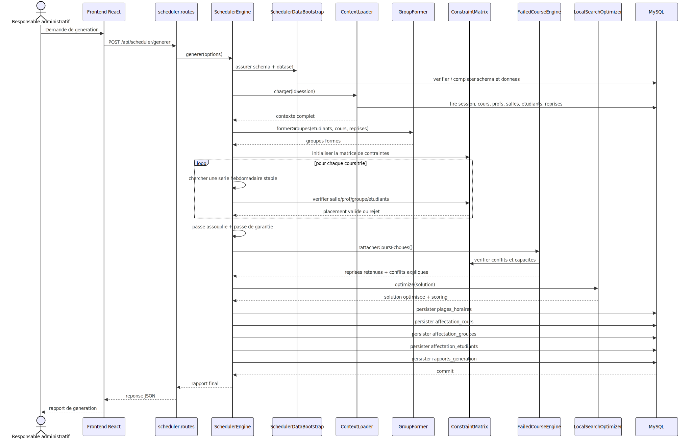
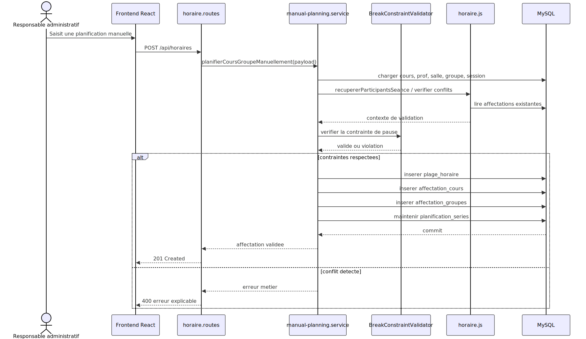
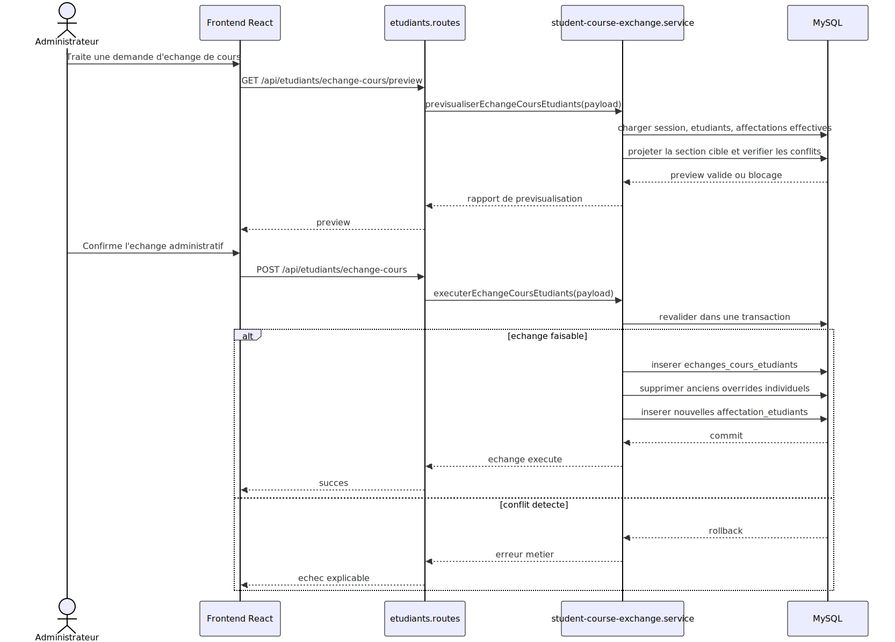

# Diagrammes Horaires-5

Ce dossier contient deux formats pour chaque diagramme :

- `*.mmd` : source Mermaid modifiable
- `*.svg` : rendu directement affichable dans l'editeur ou le navigateur

Si votre IDE n'affiche pas Mermaid dans les fichiers `.mmd`, ouvrez soit ce fichier en apercu Markdown, soit directement les fichiers `.svg`.

## Diagrammes principaux de la conception finale

### Cas d'utilisation

### Diagramme de classes

### Sequence - Generation d'un horaire

### Sequence - Planification manuelle

### Sequence - Echange de cours entre etudiants

### Activite - Moteur intelligent

